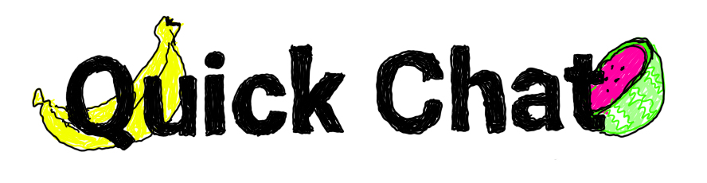
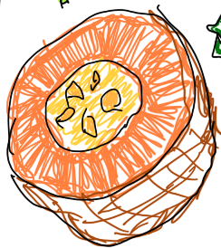

## Description
Quick Chat is an application that allows you to chat quickly

## How it works 
One user can sign up via email. When they are signed in they have the ability to send three different chat rooms to this friends. 

As a friend, you just put in your name and go!

Chat room getting a little too messy? Click the clear chat room button at the bottom.

Quick Chat is made easy. Send links to your friends and you're good to go. No signing up for a service or downloading an app. 

## Technologies Used

Quick Chat is made with React.

Firebase/Firestore and react-redux-firebase are used to handle the database's read/write ability. Also it's authorization and authentication. 

## Contact Information

jessetylercallahan@gmail.com

