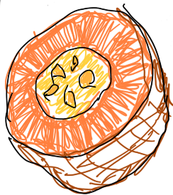

https://jessecallahan.github.io/quick_chat/

## Description
Quick Chat is an application that allows you to chat quickly

## How it works 
One user can sign up via email. When they are signed in they have the ability to send three different chat rooms to their friends. 

As a friend, you just put in your name and go!

Friend not there? Leave them a message for later.

Chat room getting a little too messy? Click the 'clear chat room' button at the bottom to clear your chat room and your friends list.

Quick Chat is made easy. Send links to your friends and you're good to go. No signing up for a service or downloading an app. 

## Technologies Used

Quick Chat is made with React.

Firebase is used as the SaaS database. That inlcudes the authorization and authentication. 

Firestore and react-redux-firebase are used to handle the read/writes.  

React Router is used to handle the endpoints.

## Contact Information

jessetylercallahan@gmail.com

